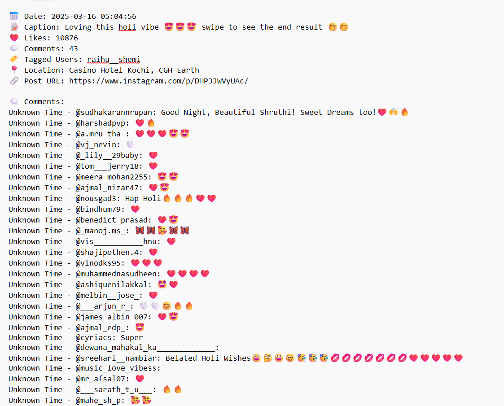

# InstagramScraper
Download photos,reels and stories as well as highlights of any instagram account, public or Private(that you have access to) to your PC folders

Install instagrapi which relies on Instagrams official API for fetching content so you don't have to worry much about authorisation issues

```
pip install instagrapi
```
Almost everything is working now, I just need to assemble everything into a desktop app
**downloadBydate.py** program downloads reels or posts between any given two dates window or posted on a single date.It even gets all the details associated with each post including the comments and saves it as separate .txt files for each post/reel.
The latest **downloadHighlights.py** program correctly downloads and saves all highlights of an user into their
respective folders having same name as the highlights section name given by that user and then under each
highlights folder all the stories under that highlights are saved as story1_dateAndTime,story2_dateAndTime and so on. For these two programs if the number of things to download is very high (for eg, user having many like more than 10, highlight sections) then Instagram might block you temporarily and ask you to manually login on the browser by completing formalities there like OTP or recaptcha. To avoid this consider increasing sleeping time in the code or even maybe try using intsgram on your browser by visiting random pages, clicking on new post and so so as to avoid Instagram from identfying your account as an autoamted program. 

**The easiest and most useful and fastest way to download something is to use _downloadbyURl.py_ to download any post or reel by copy pasting it's url into the quotes within instagram_url. It not only downloads instantly the reel videos along with its thumbnails or photo/multiple photos/combination of photos and videos included in the post and saves it with an easily identifiable name having the date and index such as post_2025-03-16_1, post_2025-03-16_2 for multiple photo post,  but also correctly extracts all the information associated with the post such as caption, location etc as well as all the comments and saves it into a .txt file as shown in the image below**



**You only need to replace amount=0 in the code with the number of latest reels or posts you want to get only that many number of latest posts or reels associated with an account**

# Dektop application (currently this version only stories works will be updated very soon)
I just need to assemble all this individual correctly working python scripts into a single Tkinter application


To use the under development Desktop app which provides buttons for easy download, as tkinter comes preinstalled with python,
just clone this repository or directly download Desktop_app.py python program, modify the program to replace
USERNAME and PASSWORD with the username and password of your account you intend to use for downloading.Run the
application, select your folder for saving the downloads, type in the username whose content you wish to download and then press on the button for what you need. Currently(March 7th 25,5am IST) unfortunately
for the desktop app only download stories work perfectly.Everything else will be made fully functional and 
integrated into the app very soon. In the meantime, you can try out the Individual programs

+ downloadPosts.py downloads all posts(meaning anything except reel)associted with an instagram account with filename post-index_date_of_posting_multiplephotoIndex.ext
+ downloadReels.py downloads all reels associted with an account and their thumbs with each filename saved as reel-index_date.ext
+ downloadStories.py downloads all stories of an account and save each story as story-index_date_timeInUtc.ext
+ downloadbyUrl.py downloads the content associated with the url specified which can be a post or reel and saved as content_date_index.ext
+ download tagged and download highlights coming soon

All the downloads have been made to run as fast as possible, but speed will ultimately depend on your network speed
Kindly ignore keyError while running downloadPosts.py. **Infact ignore any errors in the output on terminal as long as after waiting for a short while to check the folders, the download works and you get what you want**