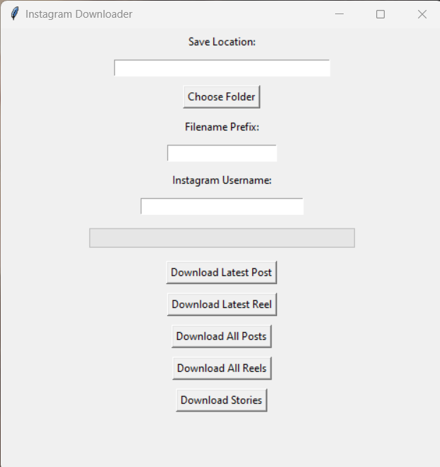

# InstagramScraper
Download photos,reels and stories of any instagram account, public or Private(that you have access to) to your PC folders

Install instagrapi which relies on Instagrams official API for fetching content so you don't have to worry much about authorisation issues

```
pip install instagrapi
```
Almost everything is working now, I just need to assemble everything into a desktop app
Latest downloadBydate.py program downloads reels or posts between any given two dates window or posted on a single date.
It even gets all the details associated with each post including the comments and saves it as separate .txt files for each post/reel.

#Dektop application



To use the desktop app which provides buttons for easy download, as tkinter comes preinstalled with python,
just clone this repository or directly download Desktop_app.py python program, modify the program to replace
USERNAME and PASSWORD with the username and password of your account you intend to use for downloading.Run the
application, select your folder for saving the downloads, type in the username whose content you wish to download and then press on the button for what you need. Currently(March 7th 25,5am IST) unfortunately
for the desktop app only download stories work perfectly.Everything else will be made fully functional and 
integrated into the app very soon. In the meantime, you can try out the Individual programs

+ downloadPosts.py downloads all posts(meaning anything except reel)associted with an instagram account with filename post-index_date_of_posting_multiplephotoIndex.ext
+ downloadReels.py downloads all reels associted with an account and their thumbs with each filename saved as reel-index_date.ext
+ downloadStories.py downloads all stories of an account and save each story as story-index_date_timeInUtc.ext
+ downloadbyUrl.py downloads the content associated with the url specified which can be a post or reel and saved as content_date_index.ext
+ download tagged and download highlights coming soon

All the downloads have been made to run as fast as possible, but speed will ultimately depend on your network speed
Kindly ignore keyError while running downloadPosts.py