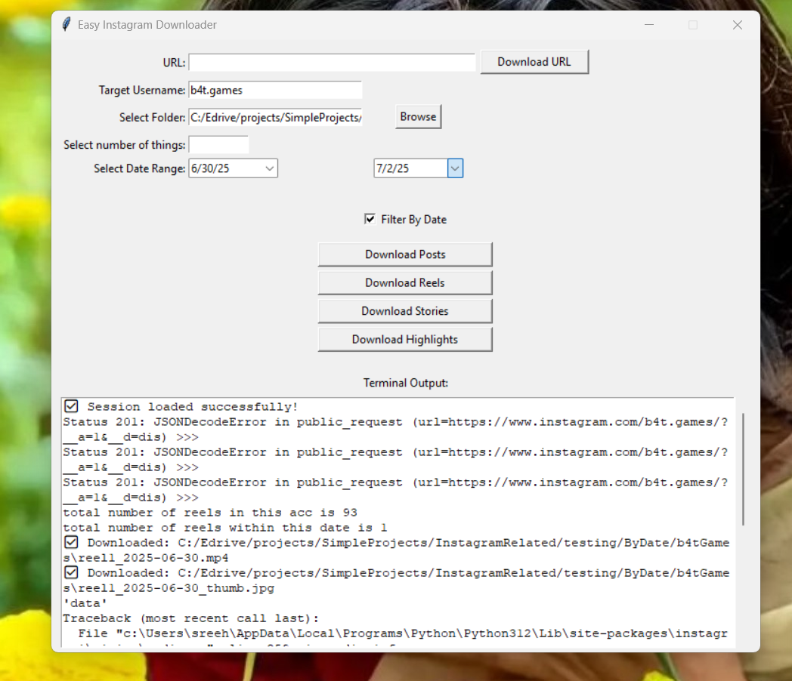
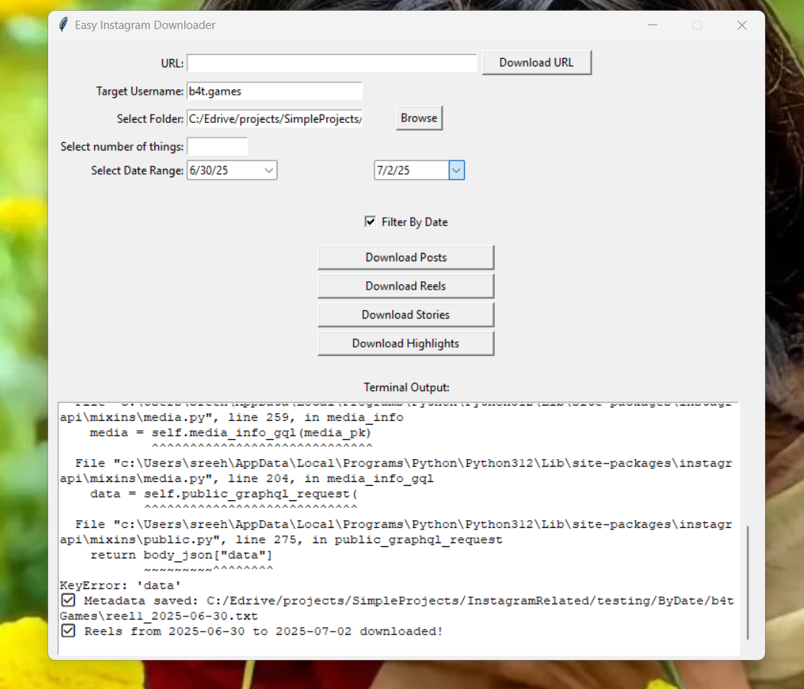
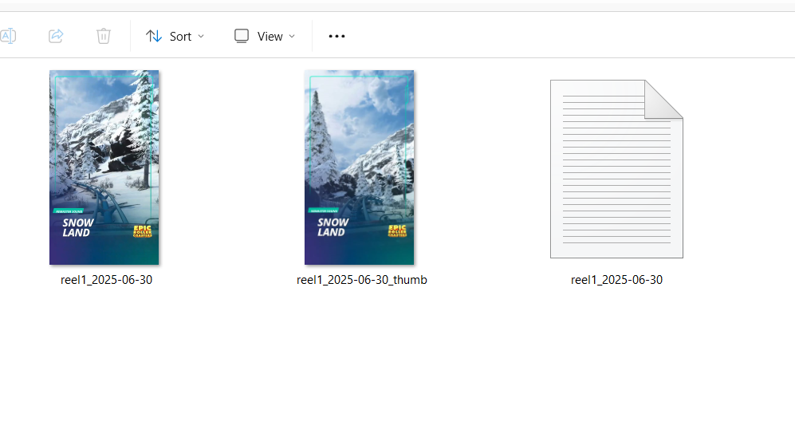
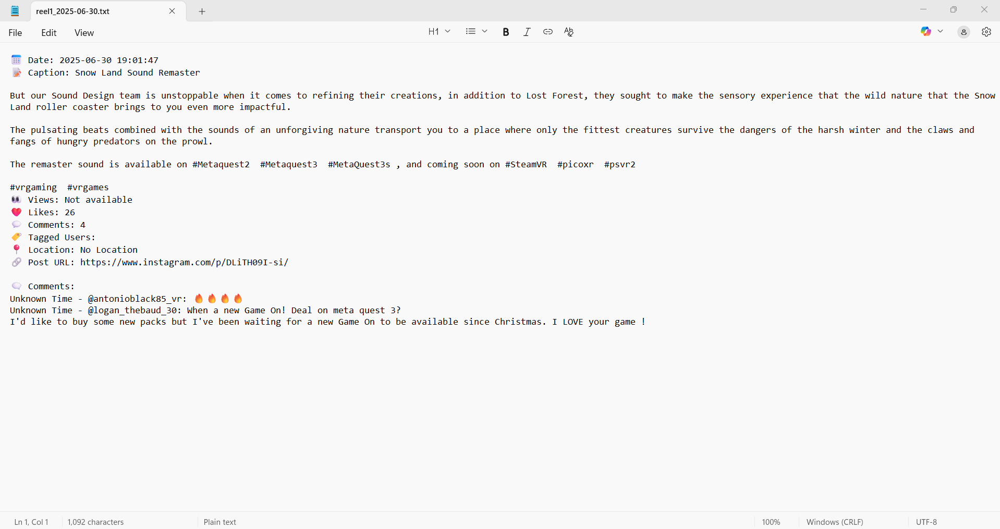
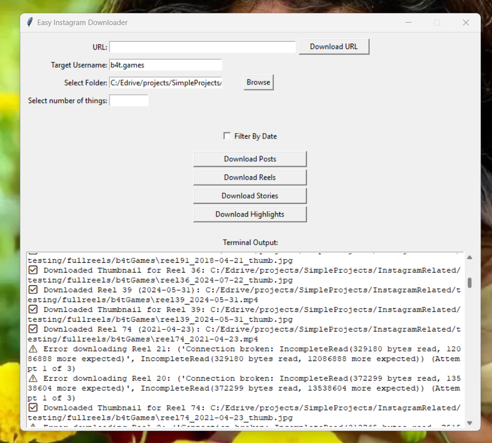
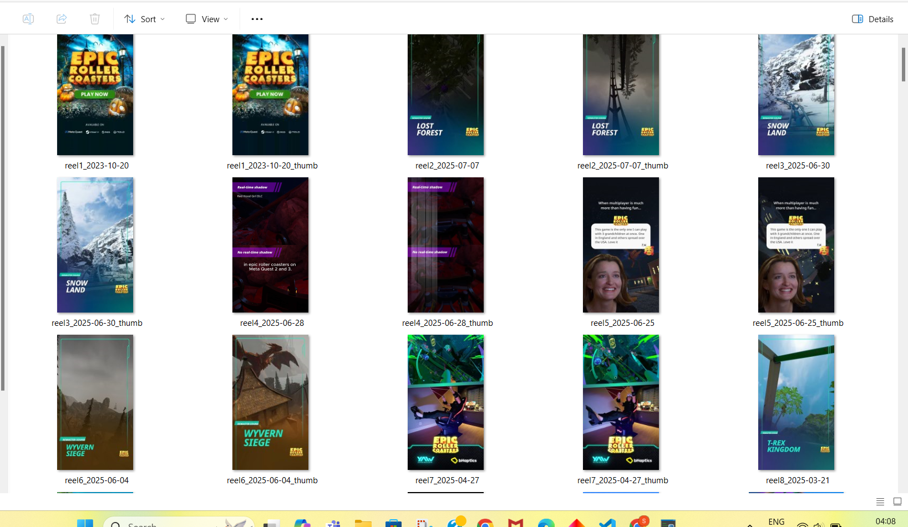
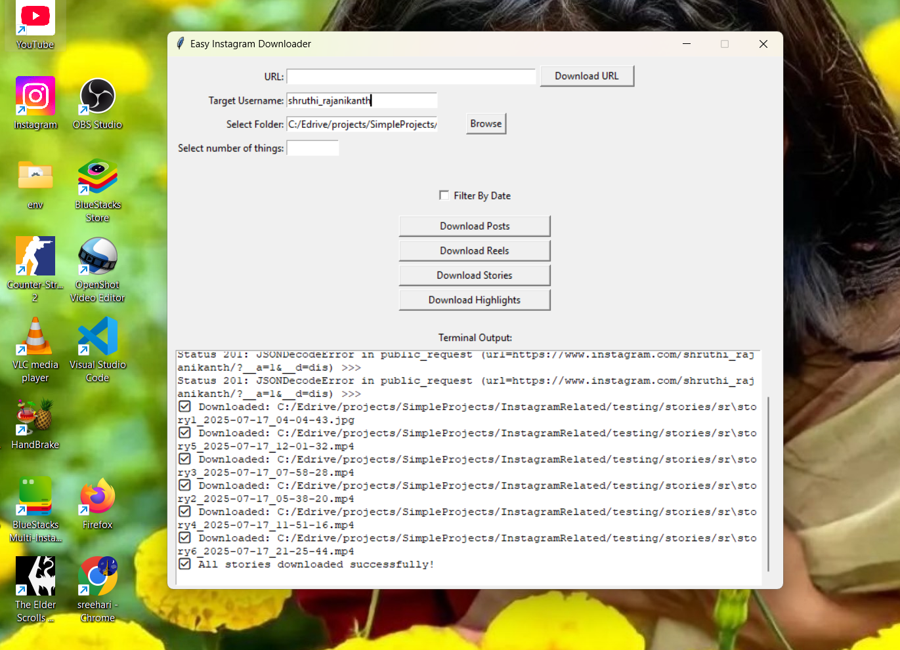
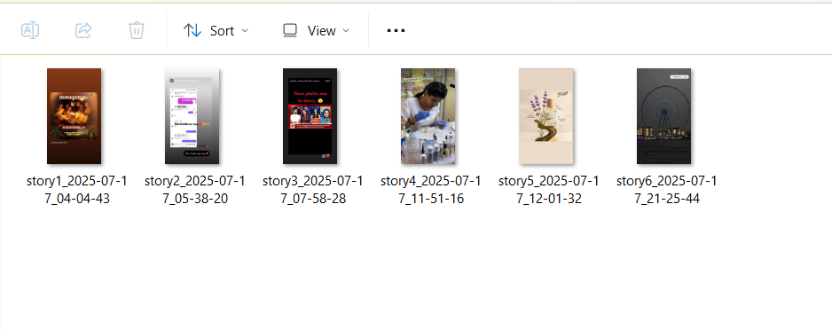
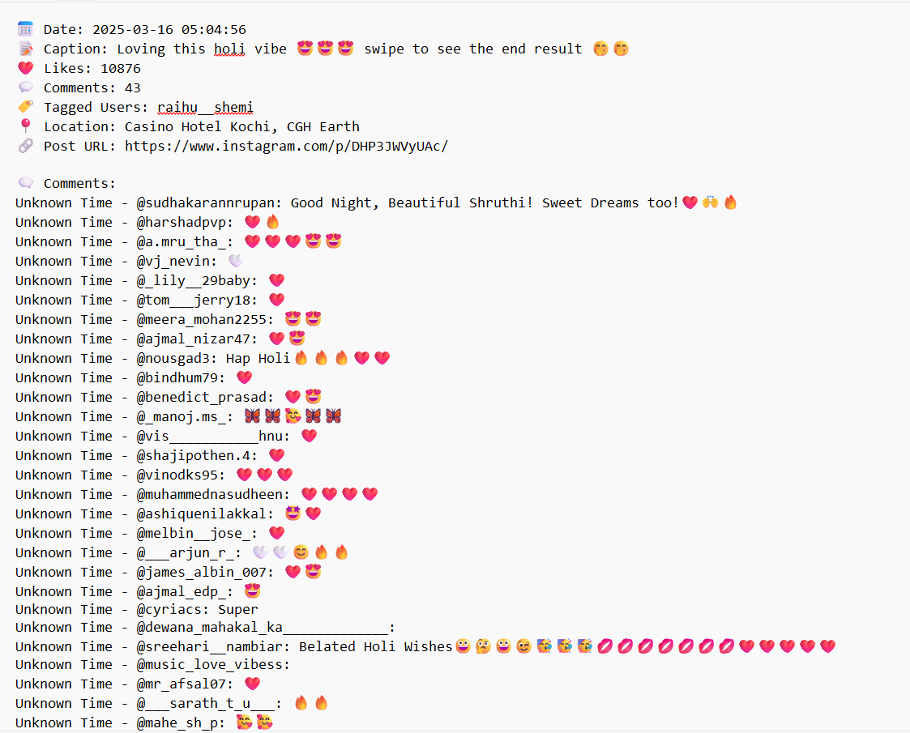

# InstagramScraper
Download photos,reels and stories as well as highlights of any instagram account, public or Private(that you have access to) to your PC folders

Install instagrapi which relies on Instagrams official API for fetching content so you don't have to worry much about authorisation issues

```
pip install instagrapi
```

# Dektop application

Images of the App In Action










To use the Desktop app which provides buttons for easy download,as tkinter comes preinstalled with python,
just clone this repository and open DesktopApplication Folder and then click on app.py python program.
When you use for the first time, you will be asked to enter username and password of your instagram acc
used for scraping. After you press the login button, you will reach the window shown in images above.Copy paste
the url of the post or reel you wish to download, click browse button to chose where to download and then finally click on Download Url button and the execution details of the program will be displayed in the terminal window. Or to get stories, enter the username of the acc into Target Username field, chose folder and click on
Download Stories button.Just giving username and folder location and then clicking on Download Posts or 
Download Reels buttons will download all posts(posts stands for all non reel media) and all reels will be
downloaded to that folder respectively whereas setting the start and end date will only download posts or 
reels within that date range and setting the Number of things field will only download that many latest 
posts or reels(pinned posts or reels will come first followed by the most recently uploaded one)

If you prefer running individual python scripts for your specific needs, then you might consider the programs
in Individual Scripts FOlder

Please note that once you login, a 'session.js' file will be saved in the same folder as containing the app.py file
and then unless and until this session.js file is deleted, you won't have to login again which is also the recommended way as Insta flags multiple logins as spam and takes action. Do not delete this session file unless
intagram challenged you, thereby requiring you to enter code sent via email or recapatcha and then sometimes your old login session is no longer valid thereby requiring you to login again. Even for such a case, try if the downloads are working before removing session file.

**Ignore Key Error while using Download Url**
**Ignore any other Error too as long as your download works**

ALso in the case of posts, when you try to download posts of an account having greater than 1000 or 2000 number of posts, then Instagram might simply deny you that request. As the program fetches all posts in one go from Instagram and then applies Date or Number Filter, even downloading just few posts or even one using these filters will also fail in such a case. Unfortunately this is just Instgram being angry at scarpping their content and even after trying all sorts of things,I couldn't overcome this. Reels should work just fine, but for post/posts of accounts having large number of posts in case the app doesn't work you might need to look for other solutions like Instaloader.

**Details Of Scripts**
**downloadBydate.py** program downloads reels or posts between any given two dates window or posted on a single date.It even gets all the details associated with each post including the comments and saves it as separate .txt files for each post/reel.
The latest **downloadHighlights.py** program correctly downloads and saves all highlights of an user into their
respective folders having same name as the highlights section name given by that user and then under each
highlights folder all the stories under that highlights are saved as story1_dateAndTime,story2_dateAndTime and so on. For these two programs if the number of things to download is very high (for eg, user having many like more than 10, highlight sections) then Instagram might block you temporarily and ask you to manually login on the browser by completing formalities there like OTP or recaptcha. To avoid this consider increasing sleeping time in the code or even maybe try using intsgram on your browser by visiting random pages, clicking on new post and so so as to avoid Instagram from identfying your account as an autoamted program. 

**The easiest and most useful and fastest way to download something is to use _downloadbyURl.py_ to download any post or reel by copy pasting it's url into the quotes within instagram_url. It not only downloads instantly the reel videos along with its thumbnails or photo/multiple photos/combination of photos and videos included in the post and saves it with an easily identifiable name having the date and index such as post_2025-03-16_1, post_2025-03-16_2 for multiple photo post,  but also correctly extracts all the information associated with the post such as caption, location etc as well as all the comments and saves it into a .txt file as shown in the image below**



**You only need to replace amount=0 in the code with the number of latest reels or posts you want to get only that many number of latest posts or reels associated with an account**

+ downloadPosts.py downloads all posts(meaning anything except reel)associted with an instagram account with filename post-index_date_of_posting_multiplephotoIndex.ext
+ downloadReels.py downloads all reels associted with an account and their thumbs with each filename saved as reel-index_date.ext
+ downloadStories.py downloads all stories of an account and save each story as story-index_date_timeInUtc.ext
+ downloadbyUrl.py downloads the content associated with the url specified which can be a post or reel and saved as content_date_index.ext
+ download tagged and download highlights coming soon

All the downloads have been made to run as fast as possible, but speed will ultimately depend on your network speed
Kindly ignore keyError while running downloadPosts.py. **Infact ignore any errors in the output on terminal as long as after waiting for a short while to check the folders, the download works and you get what you want**